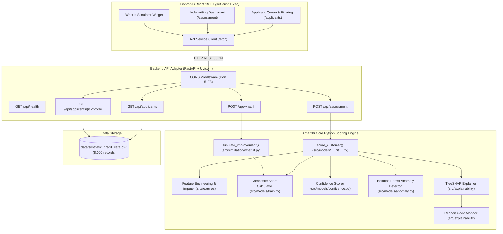

# Antardhi

> Consent-led alternative data credit underwriting engine for thin-file and informal borrowers.

Antardhi addresses the credit exclusion problem faced by millions of credit-invisible individuals and micro-enterprises across India—including kirana store owners, delivery and ride-hailing gig workers, first-time salaried borrowers, and informal rural earners. Traditional underwriting relies almost exclusively on bureau credit scores (e.g., CIBIL/Experian), formal income tax returns, and audited financial statements. When applicants lack these traditional records, conventional lenders typically assign them a blanket high-risk rating or reject them outright.

Instead of interpreting an absent credit history as an adverse signal, Antardhi evaluates verifiable digital footprints and behavioural data. By ingesting multi-vertical alternative signals—including Unified Payments Interface (UPI) transaction flows, Goods and Services Tax (GST) filing consistency, utility bill payment punctuality, mobile telecom recharge discipline, and platform gig mobility—the engine constructs an objective, multidimensional financial profile.

Antardhi produces an end-to-end explainable assessment rather than an opaque score. Every underwriting decision is broken down into domain capacity pillars, supported by a distinct evidence confidence score, gated by an independent anomaly detection pipeline, explained via TreeSHAP feature attributions with human-readable reason codes, and paired with an interactive counterfactual simulation ("What-If") engine. This prototype implementation was developed for the TVS Credit e.p.i.c 8 challenge using a parameterized, statistically grounded synthetic dataset.

---

## Key Features

- **Persona-Aware Underwriting:** Dynamically adapts evaluation criteria and component weighting across four distinct borrower profiles: Small Merchant, Gig Worker, First-time Borrower, and Informal/Rural Worker.
- **Alternative Data Coverage:** Standardizes signals across six alternative data categories: UPI cashflows, GST filings, utility bills, telecom recharges, e-commerce transactions, and mobility patterns.
- **Engineered Financial & Behavioural Signals:** Extracts five core domain indicators: `cashflow_stability`, `payment_discipline`, `business_activity_index`, `livelihood_activity`, and `income_proxy`.
- **Persona-Median Missingness Imputation:** Imputes unobserved data points using persona-specific medians rather than zero, preventing unknown records from being conflated with adverse credit behavior.
- **300–900 Composite Credit Score:** Computes a standardized credit score grounded in Capacity, Stability, and Discipline, calibrated to industry-standard 300–900 ranges and three risk tiers (Low, Medium, High).
- **Independent Confidence Score (0–100%):** Separately quantifies the depth and breadth of underlying data evidence, ensuring underwriters can distinguish high-evidence assessments from thin-evidence estimates.
- **Gated Anomaly Detection:** Employs an Isolation Forest model to detect behavioral outliers (Low, Medium, High) that routes flagged applicants to manual review without contaminating the creditworthiness score.
- **SHAP-Based Explainability & Reason Codes:** Uses TreeSHAP to attribute score impacts and maps top drivers to positive and adverse regulatory-style reason codes.
- **Financing Sizing & Amortization:** Calculates policy-based maximum loan eligibility, recommended tenure (6, 12, or 18 months), and monthly reducing-balance EMI.
- **Path-to-Eligibility ("What-If" Counterfactual Simulator):** Allows underwriters and applicants to simulate behavioural improvements (e.g., higher UPI inflow, improved utility regularity) and observe projected score, tier, and loan offer changes.
- **Applicant Queue & Filtering:** Provides a responsive underwriting dashboard with multi-criteria filtering by persona and applicant ID.
- **Modern React + FastAPI Architecture:** Powered by a high-performance FastAPI backend scoring engine and a polished React 19 + TypeScript + Vite frontend.

---

## How Antardhi Works

Antardhi follows a linear, transparent decision and explainability pipeline:

```
[Applicant Record]
       │
       ▼
[Alternative Data Ingestion] ──── (UPI, GST, Utility, Telecom, E-commerce, Mobility)
       │
       ▼
[Feature Engineering] ─────────── (Domain indices + Persona-median imputation)
       │
       ▼
[Persona-Aware Scoring] ───────── (Capacity, Stability, Discipline weighted by Persona)
       │
       ├─────────────────────────────────┬─────────────────────────────────┐
       ▼                                 ▼                                 ▼
[Credit Score & Risk Tier]      [Confidence Scoring]             [Anomaly Detection]
 (300–900 scale + Tiers)        (Data depth & coverage)          (Isolation Forest gating)
       │                                 │                                 │
       └─────────────────────────────────┼─────────────────────────────────┘
                                         ▼
                             [TreeSHAP Explainability]
                              (Top 5 positive & adverse reason codes)
                                         │
                                         ▼
                             [Financing Sizing Policy]
                              (Recommended Loan, Tenure, EMI)
                                         │
                                         ▼
                             [What-If Simulation Engine]
                              (Counterfactual path-to-eligibility)
```

### Core Architectural Distinctions

To ensure regulatory compliance and operational clarity, Antardhi strictly separates distinct decision signals:

1. **Credit Score (300–900):** Measures creditworthiness and repayment capacity based on verifiable behavioral and financial habits.
2. **Confidence Score (0–100%):** Quantifies evidence completeness based on available history length (months) and source diversity. A score of 720 with 40% confidence conveys a thin file; 720 with 95% confidence conveys seasoned evidence.
3. **Anomaly Signal (Low / Medium / High):** Measures behavioral typicality using an unsupervised Isolation Forest. Crucially, **anomalies never lower or blend into the credit score**. High-anomaly records are routed to manual review or fraud investigation.
4. **Explainability:** Identifies which specific attributes drove the model towards or away from default risk using TreeSHAP values.
5. **What-If Simulation:** A forward-looking counterfactual tool that models the mathematical score impact of hypothetical behavioural adjustments.

---

## System Architecture

The Antardhi platform is organized into three decoupled layers: a React single-page application (SPA), a FastAPI REST service, and a modular Python analytics and inference engine.



---

## Data & Personas

Because live Indian Account Aggregator (AA), GSTN, and UPI transaction rails require regulated financial institution credentials, Antardhi includes a parameterized synthetic data generation suite (`src/data/synthetic_generator.py`) to model realistic borrowing behavior for demonstration and benchmarking.

### Dataset Profile

- **Total Records:** 8,000 synthetic customer records (`data/synthetic_credit_data.csv`).
- **Columns:** 20 schema columns adhering strictly to the project specification.
- **Overall Default Rate:** 19.88% (balanced class distribution reflecting thin-file retail portfolios).
- **Persona Balance:** 2,000 records (25.0%) for each of the four target personas.

### The Four Target Personas

| Persona | Typical Profile | Available Alternative Sources | Expected Missing Sources |
|---|---|---|---|
| **Small Merchant** | Kirana store owners, retail shopkeepers | GST filings, UPI merchant QR, Utility, E-commerce | Mobility (absent/weak), Telecom (weak) |
| **Gig Worker** | Delivery riders (Zomato/Swiggy), ride-hailing drivers (Uber/Ola) | UPI peer/platform transfers, Mobility days/trends, Telecom | GST (absent), E-commerce (weak) |
| **First-time Borrower** | Young salaried or micro-enterprise thin-file entrants | UPI personal inflows, Utility bills, Telecom recharges, Thin bureau flag | GST (absent), Mobility (weak) |
| **Informal/Rural Worker** | Daily wage earners, agricultural/artisanal workers | UPI micro-transactions, Utility payments, Telecom recharges | GST (absent), E-commerce (absent), Mobility (absent) |

### Alternative Data Categories

1. **UPI Cash-Flows:** `upi_monthly_inflow_avg` (₹ volume), `upi_inflow_volatility` (coefficient of variation), and `upi_active_days_per_month` (0–30 frequency).
2. **GST Filings:** `gst_monthly_turnover` (declared business turnover) and `gst_filing_consistency` (0–1 ratio of on-time monthly filings; applicable to merchants).
3. **Utility Bill Payments:** `utility_payment_regularity` (fraction of bills paid on time) and `utility_avg_delay_days` (mean days past due).
4. **Telecom Recharges:** `telecom_recharge_frequency` (recharges per month) and `telecom_recharge_consistency` (stability of mobile connectivity spend).
5. **E-commerce Footprint:** `ecommerce_txn_frequency` (monthly orders) and `ecommerce_return_rate` (return ratio indicating operational friction).
6. **Mobility Patterns:** `mobility_active_days` (platform operational days) and `mobility_distance_trend` (3-month % shift in operating radius for gig workers).
7. **Thin Bureau Records:** `existing_bureau_flag` (boolean) and `existing_bureau_score_partial` (partial/thin bureau score between 300 and 900 when present).
8. **Evidence Meta-Features:** `months_of_data_available` (history length in months) and `num_sources_available` (number of active connected verticals out of 6).

> **Prototype Note:** The current dataset is synthetic and intended exclusively for demonstration, benchmarking, and architectural validation.

---

## Feature Engineering

Raw data points are converted into domain indices using formulas implemented in `src/features/feature_engineering.py`:

```
1. cashflow_stability = clip(1 - upi_inflow_volatility, 0, 1)
2. payment_discipline = clip((utility_payment_regularity + telecom_recharge_consistency) / 2, 0, 1)
3. business_activity_index = gst_filing_consistency * log1p(gst_monthly_turnover)  [Merchants only; 0.0 for others]
4. livelihood_activity = clip((mobility_active_days / 30) * (1 + mobility_distance_trend), 0, 2)  [Gig workers only; 0.0 for others]
5. income_proxy = (upi_monthly_inflow_avg * upi_active_days_per_month) / 30
```

### Persona-Median Imputation

In alternative credit underwriting, missing data does not imply default or fraudulent activity. If a rural worker lacks GST filings, setting the value to zero would heavily penalize them for an institutional reality. 

Antardhi implements `PersonaMedianImputer` (`src/data/preprocessor.py`). Missing features are imputed with the median of the applicant's specific persona cohort. This preserves the distinction between unknown information (captured by the Confidence Score) and adverse behaviour (captured by the Credit Score).

---

## Credit Scoring

### Component Pillars

Antardhi computes three fundamental underwriting components, normalized to $[0.0, 1.0]$:

1. **Capacity:** Evaluates earning power and revenue generation:
   $$\text{Capacity} = \text{clip}\left(\frac{\text{income\_proxy}}{100{,}000} \times 0.7 + \frac{\text{business\_activity\_index}}{15} \times 0.3,\ 0.0,\ 1.0\right)$$
2. **Stability:** Evaluates cash-flow reliability and volatility:
   $$\text{Stability} = \text{clip}(\text{cashflow\_stability},\ 0.0,\ 1.0)$$
3. **Discipline:** Evaluates on-time bill payment and telecom consistency. When an applicant has an existing thin bureau record (`existing_bureau_flag = True`), it blends the normalized bureau score at 30% weight:
   $$\text{Discipline} = 0.7 \times \text{payment\_discipline} + 0.3 \times \left(\frac{\text{bureau\_score} - 300}{600}\right)$$

### Persona-Specific Weights

Different borrower segments generate different evidence. The composite score weights $(w_1, w_2, w_3)$ reflect the operational reality of each persona:

| Persona | Capacity ($w_1$) | Stability ($w_2$) | Discipline ($w_3$) | Rationale |
|---|---|---|---|---|
| **Small Merchant** | 50% | 30% | 20% | Commercial turnover and margin capacity dominate |
| **Gig Worker** | 40% | 20% | 40% | Platform activity and recurring bill payment discipline |
| **First-time Borrower** | 35% | 25% | 40% | Consistent bill discipline establishes willingness to pay |
| **Informal/Rural Worker** | 35% | 35% | 30% | Cash-flow consistency and seasonality resilience |

### Composite Score Formula & Risk Tiers

The composite score is scaled to the standard 300–900 bureau range:
$$\text{Composite} = w_1 \cdot \text{Capacity} + w_2 \cdot \text{Stability} + w_3 \cdot \text{Discipline}$$
$$\text{Credit Score} = \text{round}(300 + \text{Composite} \times 600)$$

| Risk Tier | Score Range | Underwriting Action | Sizing Limit | Max Tenure | Indicative APR |
|---|---|---|---|---|---|
| **Low Risk** | 750 – 900 | Standard approval | Up to 3.5× Income Proxy (Max ₹3,00,000) | 18 Months | 14.0% |
| **Medium Risk** | 600 – 749 | Conditional / sized offer | Up to 2.0× Income Proxy (Max ₹1,50,000) | 12 Months | 18.0% |
| **High Risk** | 300 – 599 | Micro-ticket / assisted path | Up to 0.5× Income Proxy (Max ₹25,000) | 6 Months | 24.0% |

Monthly reducing-balance amortization is calculated for all recommended offers:
$$\text{EMI} = P \cdot \frac{r(1+r)^n}{(1+r)^n - 1}$$
where $r = \frac{\text{APR}}{12}$ and $n = \text{tenure in months}$.

### Baseline vs. Challenger Models

Antardhi implements two distinct machine learning models alongside the composite scorecard:
- **Layer A — Regulatory Baseline:** Weight-of-Evidence (WOE) quantile binning coupled with Logistic Regression. Provides monotonic, auditable scorecard weights.
- **Layer B — Challenger Model:** LightGBM Gradient Boosted Decision Trees (`LGBMClassifier`). Captures non-linear feature interactions and serves as the foundation for TreeSHAP feature attributions.
- **Displayed Score:** The authoritative 300–900 score displayed in the user interface and API response is derived from the persona-weighted composite architecture (`src/models/train.py`), ensuring that displayed scores adhere to interpretable domain rules while benefiting from LightGBM for explainability.

---

## Confidence & Anomaly Detection

### Evidence Confidence Score

The confidence score quantifies how much data backs the score, calculated as:
$$\text{Confidence} = \text{clip}(20 \cdot \ln(1 + \text{months\_of\_data\_available}) + 10 \cdot \text{num\_sources\_available},\ 0,\ 100)$$

- **History Depth:** Accounts for tenure of available records (logarithmically scaled to reflect diminishing returns after 18–24 months).
- **Source Breadth:** Rewards applicants who link multiple alternative data sources (UPI, utility, telecom, GST, etc.).
- A score of 730 with 92% confidence qualifies for prime automation; the same score with 38% confidence warrants lower initial credit limits or step-up credit lines.

### Independent Anomaly Detection

Behavioral fraud and synthetic identities can pass basic financial filters. Antardhi deploys an unsupervised **Isolation Forest** model (`src/models/anomaly.py`, 100 estimators, 5% contamination) fitted across all numerical features.

Thresholds are calibrated against empirical decision function distributions:
- **Low Anomaly Risk (Top 80%):** Standard underwriting flow.
- **Medium Anomaly Risk (5%–20% Percentile):** Secondary validation recommended.
- **High Anomaly Risk (Bottom 5% Percentile):** Mandatory routing to manual underwriter review regardless of credit score.

> **Integrity Rule:** The anomaly flag never decreases or adjusts the numerical credit score. It acts solely as an independent governance gate.

---

## Explainability

Every underwriting decision requires clear, auditable explanations under fair lending principles. Antardhi implements `shap.TreeExplainer` on the LightGBM challenger model (`src/explainability/shap_explainer.py`).

### Reason Code Mapping

Features with the top 5 absolute SHAP values ($|\phi_i|$) are extracted and mapped to plain-language adverse and positive reason codes (`src/explainability/reason_codes.py`):

- **Positive Impact (`+`):** The feature reduces the probability of default, lifting the applicant's creditworthiness.
- **Adverse Impact (`-`):** The feature elevates default risk, lowering creditworthiness.

| Feature Factor | Positive Reason Code (`+`) | Adverse Reason Code (`-`) |
|---|---|---|
| `cashflow_stability` | "Consistent monthly inflow pattern" | "Volatile/inconsistent cash inflow" |
| `payment_discipline` | "Regular utility & recharge payments" | "Irregular bill payment history" |
| `business_activity_index` | "Growing, consistent business turnover" | "Declining/inconsistent business activity" |
| `livelihood_activity` | "Stable, active work pattern" | "Irregular work activity" |
| `existing_bureau_score_partial` | "Some positive formal credit history" | "No formal credit history available" |
| `months_of_data_available` | "Deep transaction history and seasoned digital profile" | "Short operating history available for assessment" |
| `num_sources_available` | "High alternative data source footprint and verification" | "Limited data sources available for underwriting" |

Both positive strengths and adverse factors are surfaced to underwriters and applicants, serving as clear documentation for approvals or adverse action notices.

---

## What-If Simulation

The Path-to-Eligibility Simulator (`src/simulation/what_if.py`) empowers applicants and underwriters to test counterfactual scenarios without altering the original customer record:

- **Supported Adjustments:**
  - Percentage changes in cash-flow: `{"inflow_pct": 20.0}` (+20% average monthly UPI inflow).
  - Target bill payment discipline: `{"utility_payment_regularity": 0.95}` (improving on-time utility payments to 95%).
  - Target telecom consistency: `{"telecom_recharge_consistency": 0.90}`.
- **Output Metrics:** Returns the baseline score, projected score, net score delta, previous/new risk tiers, and updated loan offer terms (loan amount delta, new tenure, new EMI).
- **Caveat:** The simulation is a mathematical projection of potential credit improvements based on verifiable behavioral milestones; it does not constitute a binding loan approval or guarantee of funds.

---

## API

The FastAPI backend (`backend/main.py`) exposes five REST endpoints adhering to Pydantic schemas defined in `backend/schemas.py`:

### Endpoints Summary

| Method | Endpoint | Description |
|---|---|---|
| `GET` | `/api/health` | Service health status check |
| `GET` | `/api/applicants` | Retrieve applicant IDs and personas from the dataset |
| `GET` | `/api/applicants/{customer_id}/profile` | Retrieve connected sources and raw financial indicator signals |
| `POST` | `/api/assessment` | Score an applicant, returning decision, tier, SHAP reason codes, and loan terms |
| `POST` | `/api/what-if` | Run a counterfactual simulation for proposed behavioural adjustments |

### Endpoint Details & Schemas

#### 1. `GET /api/health`
Returns system status.
```json
{
  "status": "ok"
}
```

#### 2. `GET /api/applicants`
Lists available synthetic customer IDs and their persona labels for UI queue population.
```json
[
  {
    "customer_id": "cust-gig-002",
    "persona": "Gig Worker"
  },
  {
    "customer_id": "cust-merchant-001",
    "persona": "Small Merchant"
  }
]
```

#### 3. `GET /api/applicants/{customer_id}/profile`
Returns alternative data source availability across 6 verticals and supporting raw financial signals (scaled 0–100).
```json
{
  "customer_id": "cust-gig-002",
  "persona": "Gig Worker",
  "data_coverage": {
    "upi": true,
    "gst": false,
    "utility": true,
    "telecom": true,
    "ecommerce": false,
    "mobility": true,
    "available_count": 4,
    "total_count": 6
  },
  "financial_signals": {
    "upi_activity": 93.3,
    "cashflow_stability": 72.0,
    "payment_consistency": 81.5
  }
}
```

#### 4. `POST /api/assessment`
Executes complete credit assessment for the specified applicant.

**Request:**
```json
{
  "customer_id": "cust-gig-002"
}
```

**Response:**
```json
{
  "score": 678,
  "tier": "Medium Risk",
  "confidence": 88.5,
  "anomaly_flag": "Low",
  "reason_codes": [
    {
      "factor": "payment_discipline",
      "impact": "+",
      "description": "Regular utility & recharge payments"
    },
    {
      "factor": "livelihood_activity",
      "impact": "+",
      "description": "Stable, active work pattern"
    },
    {
      "factor": "upi_inflow_volatility",
      "impact": "-",
      "description": "Volatile/inconsistent cash inflow"
    }
  ],
  "recommended_loan": 70800.0,
  "recommended_tenure_months": 12,
  "recommended_emi": 6489.12
}
```

#### 5. `POST /api/what-if`
Calculates projected score improvements for simulated behavioral shifts.

**Request:**
```json
{
  "customer_id": "cust-gig-002",
  "target_change": {
    "inflow_pct": 20.0,
    "utility_payment_regularity": 0.95
  }
}
```

**Response:**
```json
{
  "current_score": 678,
  "current_tier": "Medium Risk",
  "new_score": 752,
  "new_tier": "Low Risk",
  "delta": 74,
  "current_loan": 70800.0,
  "new_loan": 148800.0,
  "loan_delta": 78000.0,
  "recommended_loan": 148800.0,
  "recommended_tenure_months": 18,
  "recommended_emi": 9214.35
}
```

---

## Frontend

The user interface (`frontend/`) is built with React 19, TypeScript, Vite, and TailwindCSS:

- **Applicant Queue (`/applicants`):** Live search and filter controls across all 8,000 synthetic profiles by ID and persona cohort. Displays data availability summaries and quick-action links.
- **Assessment Dashboard (`/assessment`):**
  - **Profile Summary:** Persona classification and identifier.
  - **Data Coverage Matrix:** Verification status across UPI, GST, Utility, Telecom, E-commerce, and Mobility channels.
  - **Financial Fingerprint:** Visual indicators for UPI Activity, Cashflow Stability, and Payment Consistency.
  - **Decision Panel:** 300–900 Score gauge, color-coded Risk Tier badge (Low/Medium/High Risk), and loan recommendations (Loan Amount in ₹, Tenure in Months, Monthly EMI in ₹).
  - **Governance Badges:** Prominent Evidence Confidence percentage and Anomaly Status (highlighting manual review warnings when anomalous).
  - **Explainability Cards:** Categorized breakdown of positive factors and adverse factors with plain-language explanations.
  - **What-If Simulation Drawer:** Interactive sliders for adjusting monthly inflow (+0% to +50%) and utility regularity (up to 100%), dynamically rendering score deltas and loan eligibility gains.

### Frontend Technologies

- **React 19 & React DOM:** Declarative UI rendering.
- **TypeScript:** Type-safe API client and state management.
- **Vite 8:** Modern development server and build toolchain.
- **TailwindCSS 3.4:** Responsive styling and component design.
- **Lucide React:** Standard icon set for financial verticals and status badges.
- **React Router DOM 7:** Client-side routing between queue and assessment views.
- **Recharts:** Data visualization for financial components.

---

## Project Structure

```
Antardhi/
├── data/
│   └── synthetic_credit_data.csv       # 8,000-row benchmark dataset (20 columns)
├── notebooks/
│   ├── 01_exploratory_analysis.ipynb   # Persona distributions & missingness validation
│   └── 02_model_benchmarking.ipynb     # Regulatory benchmarking & SHAP validation
├── src/
│   ├── __init__.py
│   ├── config.py                       # Global scoring thresholds & persona configurations
│   ├── data/
│   │   ├── synthetic_generator.py      # Parameterized synthetic data generation suite
│   │   └── preprocessor.py             # Persona-median imputer (Section 6)
│   ├── features/
│   │   └── feature_engineering.py      # Domain formula transformations
│   ├── models/
│   │   ├── __init__.py                 # Public integration boundary: score_customer()
│   │   ├── train.py                    # Baseline WOE scorecard & Challenger LightGBM
│   │   ├── evaluate.py                 # Regulatory metrics (ROC-AUC, PR-AUC, KS, Brier)
│   │   ├── confidence.py               # Data depth & source breadth scoring
│   │   ├── anomaly.py                  # Isolation Forest anomaly detection
│   │   └── features.py                 # Numerical feature extraction pipeline
│   ├── explainability/
│   │   ├── shap_explainer.py           # TreeSHAP explainer for LightGBM
│   │   └── reason_codes.py             # Positive & adverse reason code mappings
│   ├── simulation/
│   │   └── what_if.py                  # Counterfactual simulation engine
│   └── utils/
│       └── helpers.py                  # Streamlit UI presentation helpers
├── backend/
│   ├── __init__.py
│   ├── main.py                         # FastAPI application and route definitions
│   └── schemas.py                      # Pydantic request and response models
├── frontend/
│   ├── package.json                    # Node dependencies and build scripts
│   ├── vite.config.ts                  # Vite server & build configuration
│   └── src/
│       ├── App.tsx                     # Top-level application routing
│       ├── pages/
│       │   ├── ApplicantsPage.tsx      # Applicant queue and search table
│       │   └── AssessmentPage.tsx      # Underwriting dashboard, SHAP & What-If UI
│       ├── components/
│       │   └── Layout.tsx              # Application shell and navigation header
│       └── services/
│           └── api.ts                  # Typed fetch client connecting to FastAPI
├── tests/
│   ├── test_data_generator.py          # Generator schema and correlation tests
│   ├── test_feature_engineering.py     # Feature calculation unit tests
│   └── test_model_inference.py         # score_customer() contract & constraint tests
├── assets/
│   └── README.md                       # Asset directory notes
├── app.py                              # Standalone Streamlit reference application
├── pytest.ini                          # Pytest configuration
├── requirements.txt                    # Python runtime dependencies
├── setup.py                            # Antardhi package installation configuration
├── PROJECT_SPEC.md                     # System architecture & formula source of truth
├── AGENTS.md                           # Multi-agent collaboration boundaries
└── README.md                           # Project documentation
```

---

## Setup & Installation

### Prerequisites

- **Python:** Version 3.10 or higher
- **Node.js:** Version 18.0 or higher (with npm)
- **OS:** Windows (PowerShell commands documented below) or Linux/macOS

### 1. Python Environment Setup

Open PowerShell from the repository root (`S:\Antardhi`):

```powershell
# Create virtual environment
python -m venv .venv

# Activate virtual environment (Windows PowerShell)
.venv\Scripts\Activate.ps1

# Upgrade pip and install Python dependencies
pip install --upgrade pip
pip install -r requirements.txt
```

### 2. Launch the FastAPI Backend

Run the backend from the repository root:

```powershell
uvicorn backend.main:app --reload --port 8000
```

- API Base URL: `http://127.0.0.1:8000`
- Interactive Swagger Documentation: `http://127.0.0.1:8000/docs`
- Health Endpoint: `http://127.0.0.1:8000/api/health`

### 3. Launch the React Frontend

Open a second terminal, navigate to `frontend/`, install dependencies, and start the development server:

```powershell
cd frontend
npm install
npm run dev
```

- Local Web Application: `http://localhost:5173`

*(Optional) To run the standalone Streamlit reference dashboard instead:*
```powershell
streamlit run app.py
```

---

## Testing

Antardhi includes a test suite covering the data generator, feature formulas, model inference, and output contracts.

### Running Python Unit Tests

Run the test suite from the repository root:

```powershell
pytest -q
```

**Verified Test Status:**
- `30 passed` across `test_data_generator.py`, `test_feature_engineering.py`, and `test_model_inference.py`.
- Enforces strict range assertions: score $\in [300, 900]$, confidence $\in [0.0, 100.0]$, anomaly flag $\in \{\text{Low}, \text{Medium}, \text{High}\}$, and verifies that the anomaly flag never alters the credit score.

### Verifying Frontend Production Build

Run the production TypeScript check and Vite bundler:

```powershell
cd frontend
npm run build
```

---

## Model Benchmarking

Models were trained and evaluated on the 8,000-record synthetic credit dataset using a 75/25 stratified train/test split (6,000 training rows, 2,000 held-out test rows) in `notebooks/02_model_benchmarking.ipynb`.

Under fair lending and regulatory risk standards, models are evaluated across multiple metrics rather than relying solely on accuracy:

| Metric | Layer A: Baseline (WOE + Logistic Regression) | Layer B: Challenger (LightGBM) | Challenger Lift vs. Baseline |
|---|---|---|---|
| **ROC-AUC** | **0.7701** | 0.7671 | -0.0030 |
| **PR-AUC** | **0.4426** | 0.4305 | -0.0121 |
| **KS-Statistic** | **0.4369** | 0.4150 | -0.0219 |
| **Brier Score** (lower is better) | **0.1351** | 0.1358 | +0.0007 |

### Benchmarking Insights

- **Baseline Robustness:** The Weight-of-Evidence (WOE) scorecard combined with Logistic Regression slightly outperformed LightGBM on the synthetic held-out test set (ROC-AUC 0.7701 vs. 0.7671; KS-Statistic 0.4369 vs. 0.4150). This demonstrates the power of monotonic, quantile-binned transformations on tabular credit features where relationships with default are structured and directional.
- **Role of the Challenger:** While the baseline scorecard excels at monotonic stability, LightGBM captures non-linear interactions across diverse data verticals and provides the tree structure required for TreeSHAP local explainability.
- **Architectural Synergy:** Antardhi utilizes the composite scorecard architecture for authoritative scoring while leveraging LightGBM for granular feature attributions and reason code generation.

---

## Demo Walkthrough

Follow these steps to evaluate the end-to-end prototype:

1. **Access Applicant Queue:** Open `http://localhost:5173/applicants` to view the synthetic loan applicant queue.
2. **Filter by Persona:** Filter by "Gig Worker" or "Small Merchant" to observe differing income streams and data footprints.
3. **Select Applicant:** Click "Assess" on an applicant (e.g., a Gig Worker profile).
4. **Inspect Data Coverage:** Confirm connected channels (UPI, Telecom, Mobility active; GST absent).
5. **Review Financial Fingerprint:** Examine raw behavioural health signals: UPI Activity (daily usage), Cashflow Stability (volatility index), and Payment Consistency (utility/recharge punctuality).
6. **Evaluate Credit Decision:** Check the calculated 300–900 Credit Score, Risk Tier badge (e.g., "Medium Risk"), and policy-recommended loan terms (Amount, Tenure, and Monthly EMI).
7. **Inspect Confidence & Anomaly Gating:** Note the Evidence Confidence percentage (reflecting data depth) and verify that the Anomaly Flag indicates "Low Risk" (or flags "High Risk" for manual review).
8. **Review Reason Codes:** Read the top positive factors (e.g., "Stable, active work pattern") and adverse factors (e.g., "Volatile/inconsistent cash inflow") generated by TreeSHAP.
9. **Run What-If Simulation:** Navigate to the Path-to-Eligibility drawer. Increase projected monthly UPI inflow by +20% and set utility regularity to 95%. Click "Run Simulation" to observe the projected score lift, tier upgrade, and expanded credit line.

---

## Design Philosophy

```
  ┌──────────┐        ┌──────────┐        ┌──────────┐
  │  ASSESS  │   ──>  │  EXPLAIN │   ──>  │  IMPROVE │
  └──────────┘        └──────────┘        └──────────┘
```

The core ethos of Antardhi is:
> *"Don't ask if the customer has a credit history. Ask what their financial behavior already proves."*

In emerging markets and informal economies, the absence of a formal bureau credit record is often an artifact of systemic exclusion rather than financial irresponsibility. Antardhi rethinks alternative credit around three tenets:

1. **Assess Fairly:** Use behavioural digital footprints to measure genuine earning capacity and stability, imputing unknown fields through persona medians rather than punitive zero-defaults.
2. **Explain Transparently:** Ensure that every underwriting decision is traceable to specific financial actions, giving underwriters clear auditability and giving borrowers actionable feedback.
3. **Improve Constructively:** Transform the credit assessment from a binary "yes/no" barrier into an actionable path to eligibility, showing borrowers exactly which financial behaviors will unlock financing.

---

## Limitations & Future Scope

### Current Limitations

- **Synthetic Dataset:** In the absence of production Account Aggregator (AA) and GSTN API access, the engine operates on statistically calibrated synthetic data.
- **File-Based Storage:** Applicant records are read from a local CSV store rather than a distributed relational database.
- **Development-Grade Security:** The current prototype does not implement production authentication, role-based access control (RBAC), or field-level encryption.
- **Single-Node Deployment:** Configured for local development and demonstration rather than distributed cloud infrastructure.

### Future Scope

- **Live Account Aggregator Integration:** Connect directly to Sahamati-certified Account Aggregators (AA) for consent-driven, real-time bank statement fetching.
- **OCEN Protocol Compliance:** Implement Open Credit Enablement Network (OCEN) APIs to support standardized credit product disbursement and servicing.
- **Real-Time Bureau Blending:** Integrate live bureau inquiry pulls (CIBIL/Experian) to dynamically blend thin formal bureau records into the discipline pillar.
- **Enterprise Underwriter Workflows:** Implement role-based authorization, case allocation queues, audit logging, and automated adverse action notice generation.
