<div align="center">

# ⚡ Antardhi
### *Illuminating the Invisible: Explainable Alternative Credit Scoring for New-to-Credit India*

[](https://www.python.org/)
[](https://opensource.org/licenses/MIT)
[](https://www.tvscredit.com/)
[](https://lightgbm.readthedocs.io/)
[](https://streamlit.io/)
[](https://github.com/psf/black)

<p align="center">
  <strong>Antardhi</strong> (<i>अन्तर्धि</i> — Sanskrit for <i>"that which is veiled or concealed"</i>) is an AI-powered alternative data credit decisioning engine engineered for <strong>TVS Credit e.p.i.c 8</strong>. It transforms fragmented everyday digital footprints into transparent, auditable credit scores for India's 160M+ credit-invisible population.
</p>

[Problem Statement](#-problem-statement) • [What is Antardhi](#-what-is-antardhi) • [Key Features](#-key-features) • [System Architecture](#-system-architecture) • [Tech Stack](#-tech-stack) • [Screenshots & Demo](#-screenshots--demo) • [How It Works](#-how-it-works) • [Dataset & Sourcing](#-dataset--data-sourcing-note) • [Getting Started](#-getting-started) • [Project Structure](#-project-structure) • [Team](#-team--hackathon-credit) • [License](#-license)

</div>

---

## 🎯 Problem Statement

In India, more than **160 million adults** are categorized as **"Credit Invisible"** or **New-to-Credit (NTC)** — possessing zero credit history with traditional bureaus like CIBIL, Experian, or CRIF High Mark. Over **63 million Micro, Small, and Medium Enterprises (MSMEs)** face an addressable credit deficit exceeding **$300 Billion**, severely constrained by collateral-first, bureau-dependent underwriting models.

```
Traditional Lending Dilemma:
No Prior Credit History ──> Instant Bureau Rejection ──> No Formal Loan ──> No Credit History Created
```

First-time borrowers, gig delivery executives, kirana store owners, rural artisans, and informal sector workers generate active, reliable economic value every single day. Yet, conventional banking algorithms treat an absent bureau footprint as high risk. This forces creditworthy borrowers into the hands of unregulated moneylenders charging usurious rates (36% to 120% APR).

**The Challenge:** Build an intelligent, unbiased alternative credit scoring engine that evaluates financial character and cashflow reliability without a single bureau record, aligned with TVS Credit's mission of empowering Tier 3, Tier 4, and rural Bharat.

---

## 💡 What is Antardhi?

**Antardhi** is an explainable machine learning credit engine that bypasses traditional bureau dependency by evaluating multidimensional alternative data signals — including UPI merchant cashflows, GST return cadence, utility bill punctuality, telecom recharge continuity, e-commerce order trends, and mobility patterns.

By synthesizing these non-linear behavioral signals, Antardhi predicts probability of default ($PD$) and calibrates an intuitive credit score (ranging from 300 to 900). Crucially, Antardhi pairs every decision with **TreeSHAP-derived plain-language explanations**, giving underwriters complete auditability and providing applicants with actionable adverse-action factor codes to foster genuine financial inclusion.

---

## ✨ Key Features

- **Multi-Vertical Alt-Data Fusion**: Ingests, normalizes, and correlates signals across 6 alternative data domains:
  - *GST Metrics:* Return filing punctuality, turnover consistency, input tax credit (ITC) ratios.
  - *UPI & QR Flows:* Inflow velocity, counterparty diversity, month-end balance retention, ticket-size distributions.
  - *Utility Footprint (BBPS):* Electricity and water payment timeliness, historical defaults, seasonal bill variations.
  - *Telecom Behavior:* Recharge frequency, average plan tier, SIM tenure, network continuity.
  - *E-Commerce & Digital Commerce:* Seller/buyer dispute rates, order fulfillment volume, returns ratio.
  - *Mobility & Vehicle Usage:* Daily route consistency, operational fuel expense patterns, telematics telemetry.
- **Calibrated Gradient Boosting Core**: High-performance LightGBM and XGBoost models specifically tuned for class-imbalanced credit risk estimation, outputting statistically calibrated Default Probabilities ($PD$).
- **Regulatory-Grade Explainability (XAI)**: Native TreeSHAP integration breaking down every applicant's score into exact directional impact vectors, automatically converted into clear, human-readable **Reason Codes** (e.g., *"Consistent UPI inflow consistency boosted score by +38 pts"*).
- **Persona-Segmented Risk Calibration**: Specialized feature pipelines tailored to distinct borrower archetypes:
  - 🛵 *Gig Economy Workers* (weekly platform payouts, high mobile data usage, fuel expenditure)
  - 🏪 *Kirana & Micro-Merchants* (daily QR sweeps, seasonal restocking, supplier payment discipline)
  - 🌾 *Rural & Agri-Entrepreneurs* (cyclical harvest liquidity, fertilizer/seed bill cadences)
  - 💼 *Salaried First-Time Borrowers* (entry-level digital payroll, recurring rent & utility outlays)
- **Cross-Signal Anomaly & Anti-Fraud Shield**: Detects fabricated profiles through heuristic reconciliation (e.g., high reported GST turnover mismatched against minimal electricity consumption or zero telecom activity).
- **Interactive Underwriter Cockpit**: Clean Streamlit dashboard supporting single-profile assessment, batch CSV scoring, counterfactual "What-If" sensitivity simulations, and exportable credit risk memos.

---

## 🏗️ System Architecture

```mermaid
flowchart TD
    subgraph S1["1. Alternative Data Ingestion (Simulated AA Ecosystem)"]
        A1["GST Invoicing & Filing Trends"]
        A2["UPI & QR Merchant Cashflows"]
        A3["Telecom Recharge Cadence"]
        A4["Utility Bill Timeliness (BBPS)"]
        A5["E-Commerce Logistics & Ratings"]
        A6["Mobility & Telematics Signals"]
    end

    subgraph S2["2. Feature Engineering & Signal Synthesis"]
        B1["Cashflow Volatility & Seasonality Ratios"]
        B2["Payment Punctuality Index (PPI)"]
        B3["Discretionary vs Essential Outflow Ratio"]
        B4["Recharge Continuity & Stability Metric"]
        B5["Cross-Source Anomaly & Fraud Filters"]
    end

    subgraph S3["3. Persona Segmentation & Predictive Modeling"]
        C1["Persona Router: Gig / Kirana / Rural / NTC Salaried"]
        C2["Calibrated LightGBM Risk Ensemble"]
        C3["Default Probability (PD) Estimation"]
        C4["Score Calibration (Scaled to 300 - 900)"]
    end

    subgraph S4["4. Explainability & Compliance Engine"]
        D1["TreeSHAP Feature Attribution"]
        D2["Top Positive & Negative Factor Extraction"]
        D3["Plain-Language Adverse Action Generator"]
    end

    subgraph S5["5. Decisioning & Underwriter Cockpit"]
        E1["Underwriter Dashboard (Streamlit UI)"]
        E2["Risk Band Assignment: Prime / Near-Prime / Sub-Prime"]
        E3["Loan Decision: Sanction / Manual Review / Decline"]
        E4["Audit-Ready PDF/JSON Credit Memo"]
    end

    S1 --> S2
    S2 --> S3
    S3 --> S4
    S4 --> S5
```



---

## 💻 Tech Stack

| Layer | Technology | Purpose & Implementation |
| :--- | :--- | :--- |
| **Language** | `Python 3.10+` | Core execution environment for pipeline, models, and UI |
| **Machine Learning** | `LightGBM`, `XGBoost`, `Scikit-Learn` | Gradient-boosted decision trees for default risk classification with hyperparameter optimization |
| **Explainability (XAI)** | `SHAP` (TreeSHAP) | Mathematical Shapley value decomposition for local and global model interpretability |
| **Data & Feature Pipelines** | `pandas`, `NumPy`, `SciPy` | Non-linear financial timeseries transformation, moving averages, volatility modeling |
| **Dashboard & UI** | `Streamlit`, `Plotly`, `Altair` | Interactive underwriter interface, interactive score gauges, and waterfall charts |
| **Synthetic Simulation** | `Faker`, `NumPy Random Generator` | Persona-based synthetic data generator enforcing realistic covariance structures |
| **Quality & Governance** | `Black`, `Flake8`, `pytest` | Code formatting, static linting, and automated unit test suite |

---

## 📸 Screenshots & Demo

Below is an overview of the Antardhi Underwriter Cockpit interface:

### 1. Risk Score & Underwriting Dashboard

*Real-time credit score gauge (300–900 scale), default probability estimation ($PD$), suggested credit limit, and risk tier categorization (Prime, Near-Prime, Sub-Prime).*

### 2. SHAP Explainability & Factor Attribution View

*TreeSHAP waterfall breakdown revealing exact positive and negative feature contributions driving the applicant's score, translated into plain English reason codes.*

### 3. Applicant Alternative Data Profiler

*Multi-vertical data ingestion form capturing GST turnover, UPI cashflow dynamics, utility payment records, telecom recharge trends, and mobility stability.*

---

## ⚙️ How It Works

```
[Raw Footprint] ─> [Feature Matrix] ─> [Persona Tuning] ─> [LightGBM PD] ─> [SHAP Attribution] ─> [Sanction & Limit]
```

1. **Multi-Source Data Ingestion**: Alternative data points are collected across six functional verticals representing recurring financial responsibility and cashflow velocity.
2. **Behavioral Feature Engineering**: Signals are transformed into actionable financial indices, such as:
   - *Payment Punctuality Index (PPI):* Fraction of bills settled before or on due date over a rolling 12-month window.
   - *Cashflow Health Index (CHI):* Ratio of average end-of-day bank balance to peak monthly obligations.
   - *Digital Footprint Continuity (DFC):* Longevity and consistency of primary telecom recharge packs.
3. **Persona-Specific Risk Scoring**: The applicant is routed through persona-aware model weights, allowing a Kirana owner's inventory cycles to be evaluated differently from a delivery executive's weekly incentives.
4. **Calibrated Score Generation**: The model calculates the Probability of Default ($PD \in [0, 1]$), which is monotonically mapped to an intuitive **Antardhi Credit Score (300–900)**:
   $$\text{Score} = 300 + (1 - PD) \times 600$$
5. **SHAP Factor Breakdown & Regulatory Reason Codes**: The TreeSHAP explainer computes local Shapley values $\phi_i$ for each feature. The top positive drivers and top risk indicators are translated into adverse-action-compliant reason codes for underwriter inspection.
6. **Decision Matrix & Recommended Terms**: The score maps to an automated decision:
   - **Score 750 – 900 (Low Risk / Prime):** Instant sanction with optimal interest pricing.
   - **Score 620 – 749 (Moderate Risk / Near-Prime):** Conditional approval with alternative collateral or co-borrower review.
   - **Score 300 – 619 (High Risk / Sub-Prime):** Structured decline with personalized steps for creditworthiness building.

---

## 📋 Dataset & Data Sourcing Note

> [!NOTE]
> **Production Context vs. Hackathon Prototype**
> 
> In a production banking deployment, alternative data in India is obtained through the **RBI-regulated Account Aggregator (AA) ecosystem** (NBFC-AA framework) under strict, user-mediated electronic consent, alongside authenticated APIs from **GSTN (Goods & Services Tax Network)** and **BBPS (Bharat Bill Payment System)**.
>
> Because live customer AA data cannot be accessed without registered financial entity credentials, **Antardhi utilizes an advanced synthetic data generator** (`src/data/synthetic_generator.py`). 
> 
> The generator simulates realistic multi-vertical datasets for **10,000+ synthetic Indian borrower profiles** across four key personas. Rather than producing uniform random noise, it incorporates realistic covariance structures (e.g., seasonal dip in Kirana sales during monsoons, correlated telecom recharge drop-offs during cash distress, and platform incentive spikes for festival gig workers) to train and validate robust ML models.

---

## 🚀 Getting Started

Follow these steps to set up and run Antardhi locally:

### Prerequisites
- Python 3.10 or higher
- Git
- `pip` or `conda`

### 1. Clone the Repository
```bash
git clone https://github.com/your-username/antardhi.git
cd antardhi
```

### 2. Create and Activate a Virtual Environment
```bash
# Windows
python -m venv venv
.\venv\Scripts\activate

# Linux / macOS
python3 -m venv venv
source venv/bin/activate
```

### 3. Install Dependencies
```bash
pip install --upgrade pip
pip install -r requirements.txt
```

### 4. Generate Synthetic Alternative Dataset
```bash
python src/data/synthetic_generator.py --samples 5000 --output data/synthetic_credit_data.csv
```

### 5. Train the Scoring Engine & Calibrate Models
```bash
python src/models/train.py
```
*This script preprocesses the dataset, trains the LightGBM risk ensemble, saves model artifacts to `models/`, and generates ROC-AUC / PR-AUC validation reports.*

### 6. Launch the Antardhi Underwriter Cockpit
```bash
streamlit run app.py
```
Access the application in your browser at `http://localhost:8501`.

---

## 📂 Project Structure

```
antardhi/
├── assets/                          # UI screenshots, diagrams, and brand assets
│   ├── dashboard.png                # Underwriting cockpit view
│   ├── explainability.png           # SHAP attribution waterfall chart
│   └── applicant_input.png          # Alternative data profiling form
├── data/                            # Raw, synthetic, and processed data stores
│   └── synthetic_credit_data.csv    # Generated multi-vertical alternative data
├── notebooks/                       # Research, EDA, and model experimentation
│   ├── 01_exploratory_analysis.ipynb# Persona distributions & correlation heatmaps
│   └── 02_model_benchmarking.ipynb  # LightGBM vs. XGBoost vs. Baseline Logistic Reg
├── src/                             # Core production source code
│   ├── __init__.py
│   ├── config.py                    # Risk bands, score scaling constants, model configs
│   ├── data/
│   │   ├── __init__.py
│   │   ├── synthetic_generator.py   # Correlated persona-based alt-data synthesizer
│   │   └── preprocessor.py          # Missing value imputers, encoders, and scalers
│   ├── features/
│   │   ├── __init__.py
│   │   └── feature_engineering.py   # Payment punctuality, cashflow stability, & ratios
│   ├── models/
│   │   ├── __init__.py
│   │   ├── train.py                 # Training pipeline, cross-validation & calibration
│   │   └── evaluate.py              # KS-statistic, ROC-AUC, Brier score computations
│   ├── explainability/
│   │   ├── __init__.py
│   │   ├── shap_explainer.py        # TreeSHAP feature extraction and force plots
│   │   └── reason_codes.py          # Regulatory adverse action and positive factor mapping
│   └── utils/
│       ├── __init__.py
│       └── helpers.py               # Risk tier formatting, memo export, and visualizations
├── tests/                           # Unit tests
│   ├── test_feature_engineering.py  # Feature calculation tests
│   └── test_model_inference.py      # Score output bounds and calibration tests
├── app.py                           # Streamlit interactive application entry point
├── requirements.txt                 # Project dependencies
├── setup.py                         # Package installation script
├── .gitignore                       # Standard Python & data gitignore
├── LICENSE                          # MIT License
└── README.md                        # Project documentation
```

---

## 👥 Team & Hackathon Credit

Antardhi was conceptualized and developed for the **TVS Credit e.p.i.c 8 (Enrich Perform Innovate Challenge)** hackathon.

- **Hackathon Track:** *Alternative Data Credit Engine for the Invisible Customer*
- **Sponsoring Institution:** TVS Credit Services Limited
- **Focus Demographic:** New-to-Credit (NTC) individuals, rural entrepreneurs, gig economy workers, and informal micro-enterprises across Tier 2, Tier 3, and rural India.

---

## 📜 License

This project is licensed under the **MIT License** — see the [LICENSE](LICENSE) file for details.

---

<div align="center">
  <sub>Built with ❤️ for financial inclusion in Bharat.</sub>
</div>
